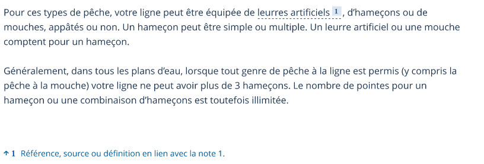

.. include:: ../Includes.txt

.. _introduction:

============
Introduction
============

What does it do?
================

Display footnote defined in content of rich text editor of contents

Screenshots
===========

An example of footnote displayed in a page.

